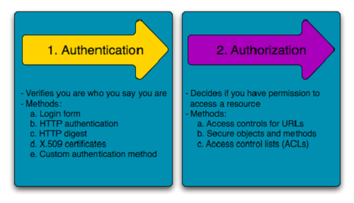

# Authentication

## OAuth

**OAuth** is an open-standard authorization protocol or framework that describes how unrelated servers and services can safely allow authenticated access to their assets without actually sharing the initial, related, single logon credential. In authentication parlance, this is known as secure, third-party, user-agent, delegated authorization. *Example* : when you go to log onto a website and it offers one or more opportunities to log on using another website’s/service’s logon. 

**How does it work:**

1. The first website connects to the second website on behalf of the user, using OAuth, providing the user’s verified identity.

2. The second site generates a one-time token and a one-time secret unique to the transaction and parties involved.

3. The first site gives this token and secret to the initiating user’s client software.

4. The client’s software presents the request token and secret to their authorization provider (which may or may not be the second site).

5. If not already authenticated to the authorization provider, the client may be asked to authenticate. After authentication, the client is asked to approve the authorization transaction to the second website.

6. The user approves (or their software silently approves) a particular transaction type at the first website.

7. The user is given an approved access token (notice it’s no longer a request token).

8. The user gives the approved access token to the first website.

9. The first website gives the access token to the second website as proof of authentication on behalf of the user.

10. The second website lets the first website access their site on behalf of the user.

11. The user sees a successfully completed transaction occurring.

12. OAuth is not the first authentication/authorization system to work this way on behalf of the end-user. In fact, many authentication systems, notably Kerberos, work similarly. What is special about OAuth is its ability to work across the web and its wide adoption. It succeeded with adoption rates where previous attempts failed (for various reasons). 

#### OpenID

Is a security technology <  pithily put it: "OpenID is for humans logging into machines, OAuth is for machines logging into machines on behalf of humans." >

## Authentication and Authorization Flows

**Authorization Code Flow**; exchanges an Authorization Code for a token.

**Authorization Code Flow (PKCE)**, require additional security.

**Implict Flow**: is intended for Public Clients, or applications which are unable to securely store Client Secrets. 

**Client Credentials Flow** : machine-to-machine (M2M) applications, such as CLIs, daemons, or services running on your back-end, the system authenticates and authorizes the app rather than a user.

**Device Authorization Flow**: with input-constrained devices that connect to the internet, rather than authenticate the user directly, the device asks the user to go to a link on their computer or smartphone and authorize the device. 

**Resource Owner Password Flow**: requests that users provide credentials (username and password), typically using an interactive form.

References:

* [OAuth](https://www.csoonline.com/article/3216404/what-is-oauth-how-the-open-authorization-framework-works.html).

* [Authentication and Authorization Flows](https://auth0.com/docs/flows).