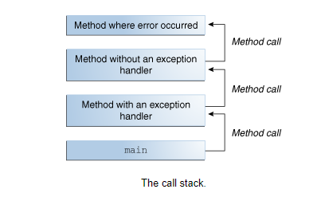
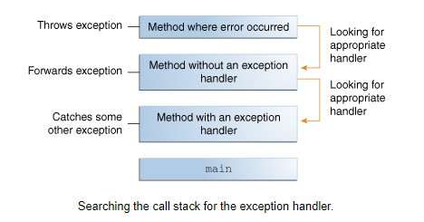

# Maps, primitives, File I/O

## Primitives vs. Objects

1. 
```
// primitive type
int x = 5;

// Object type
Integer = 5
```
2. Objects need more space in memory:
**Sizes :**

*For Primitives*:

* boolean – *1 bit*
* byte – *8 bits*
* short, char – *16 bits*
* int, float – *32 bits*
* long, double – *64 bits*

*For Objects*:

* Boolean – *128 bits*
* Byte – *128 bits*
* Short, Character – *128 bits*
* Integer, Float – *128 bits*
* Long, Double – *192 bits*

3. Primatives' live in the Stack while Objects live in Heap.
4. We use wrapper classes for objects .
5. Objects require more time to perform operations.
6. Default values for wrapper classes are null.
7. Objects and wrapper classes to use collections.


## Scanner Objects

1. Breaking Input into Tokens.
2. Treats all input tokens as simple String values.
3. Supports tokens for all of the Java language's primitive types (except for char), as well as BigInteger and BigDecimal.
4. We have to mention the locale, because thousands separators and decimal symbols are locale specific.

## Exceptions 

**An exception is an event that occurs during the execution of a program that disrupts the normal flow of instructions.**





1. Checked ex. `java.io.FileNotFoundException` /*Subject*
2. Runtime ex. `java.io.IOError` / can not read file because of system or hardware /*Not Subject*
3. Error ; programming bugs, such as logic errors or improper use of an API , ex. `NullPointerException` /*Not Subject*

Exception Handler components -->*try, catch & finally*


References:

* [Java Primitives versus Objects](https://www.baeldung.com/java-primitives-vs-objects)

* [Exceptions in JAVA](https://docs.oracle.com/javase/tutorial/essential/exceptions/index.html)

* [Scanning](https://docs.oracle.com/javase/tutorial/essential/io/scanning.html)