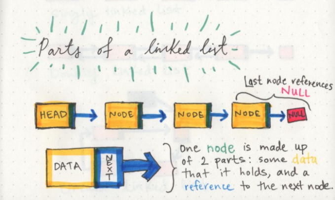

# Linked Lists

**A Linked List is a sequence of Nodes that are connected/linked to each other. The most defining feature of a Linked List is that each Node references the next Node in the link.**

### Big O 

 a way to express the amount of time that a function, action, or algorithm takes to run based on how many elements we pass to that function.

References:

* [Linked Lists](https://codefellows.github.io/common_curriculum/data_structures_and_algorithms/Code_401/class-05/resources/singly_linked_list.html)

* [Linked Lists-2](https://medium.com/basecs/whats-a-linked-list-anyway-part-1-d8b7e6508b9d)

* [Linked Lists-3](https://medium.com/basecs/whats-a-linked-list-anyway-part-2-131d96f71996)
