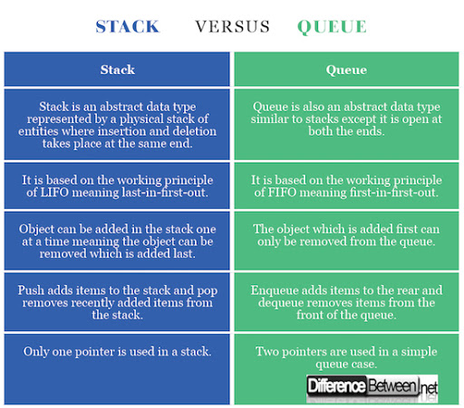

# Stack 

is a data structure that consists of Nodes. Each Node references the next Node in the stack, but does not reference its previous.

1. the first item added in the stack will be the last item popped out of the stack.

2. the last item added to the stack will be the first item popped out of the stack.

3. Popping a Node off a stack is the action of removing a Node from the top. When conducting a pop, the top Node will be re-assigned to the Node that lives below and the top Node is returned to the user.

4. Pushing a Node onto a stack will always be an O(1) operation. This is because it takes the same amount of time no matter how many Nodes (n) you have in the stack.

5. Popping a Node off a stack is the action of removing a Node from the top. When conducting a pop, the top Node will be re-assigned to the Node that lives below and the top Node is returned to the user.

6. When conducting a peek, you will only be inspecting the top Node of the stack.

# Queues

1. the first item in the queue will be the first item out of the queue.

2. the last item in the queue will be the last item out of the queue.

3. When you add an item to a queue, you use the enqueue action. This is done with an O(1) operation in time because it does not matter how many other items live in the queue (n); it takes the same amount of time to perform the operation.

4. When you remove an item from a queue, you use the dequeue action. This is done with an O(1) operation in time because it doesn’t matter how many other items are in the queue, you are always just removing the front Node of the queue.

5. When conducting a peek, you will only be inspecting the front Node of the queue.

Reference: 

* [Stack and Queues](https://codefellows.github.io/common_curriculum/data_structures_and_algorithms/Code_401/class-10/resources/stacks_and_queues.html)