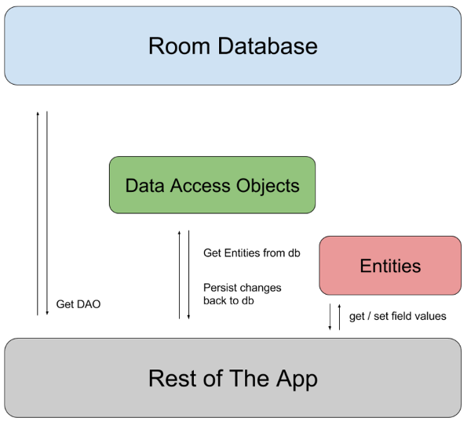

# Room

The Room persistence library provides an abstraction layer over SQLite to allow fluent database access while harnessing the full power of SQLite. 

It's highly recommend that you use Room instead of using the SQLite APIs directly.

Room Components are mainly:
1. The database class that holds the database and serves as the main access point for the underlying connection to your app's persisted data.
2. Data entities that represent tables in your app's database.
3. Data access objects (DAOs) that provide methods that your app can use to query, update, insert, and delete data in the database.

Data access object **(DAO)** => to provide methods interacting with data.

## Entities in room

You define each Room entity as a class that is annotated with @Entity. A Room entity includes fields for each column in the corresponding table in the database, including one or more columns that comprise the primary key.

Each Entity should have a unique primary key.

Because SQLite is a relational database, you can specify relationships between entities. Even though most object-relational mapping libraries allow entity objects to reference each other,***Room explicitly forbids this.***

One to one, one to many & many to many relationships => check the implementation from the references below.

### DAO 
is either an interface or an abstract class. For basic use cases, you should usually use an interface. In either case, you must always annotate your DAOs with @Dao. DAOs don't have properties, but they do define one or more methods for interacting with the data in your app's database. => ( `@Insert`, `@Delete`, `@Update`, `@Query`).

If your app's logic requires direct access to the return rows, you can write your DAO methods to return a ***Cursor object***

References:

* [Overview: Saving data with Room](https://developer.android.com/training/data-storage/room)
* [Defining entities in Room](https://developer.android.com/training/data-storage/room/defining-data)
* [Related entities in Room](https://developer.android.com/training/data-storage/room/relationships)
* [Accessing data with Room](https://developer.android.com/training/data-storage/room/accessing-data#java)